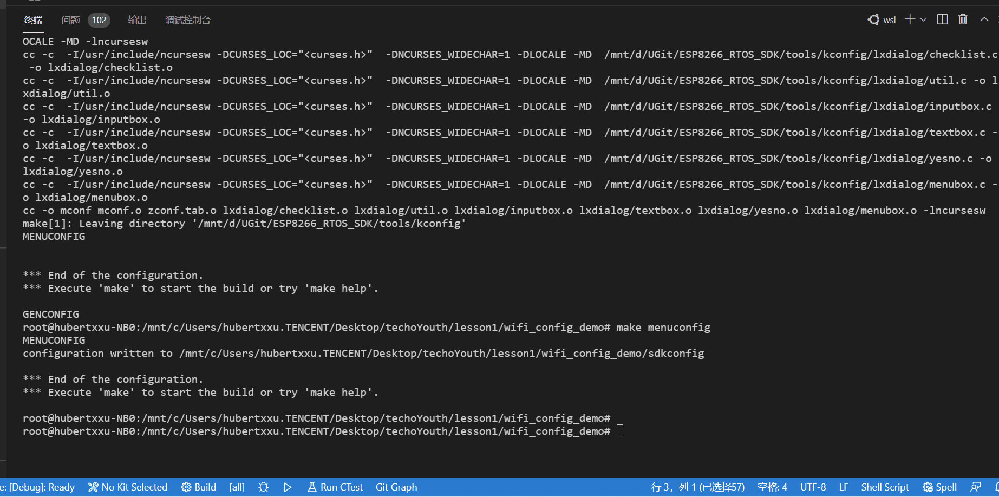
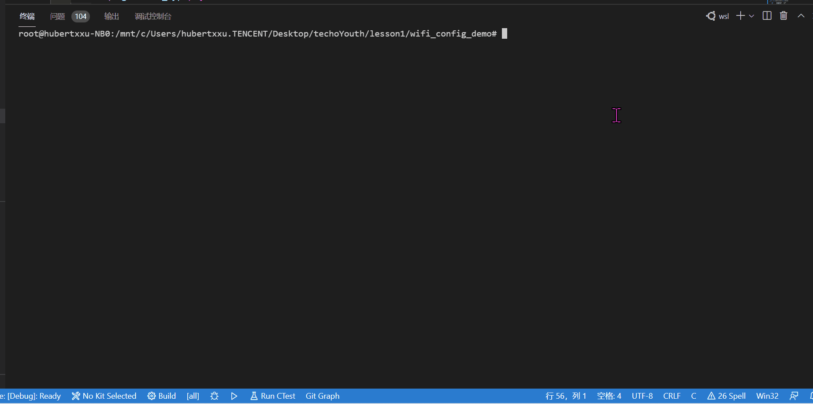
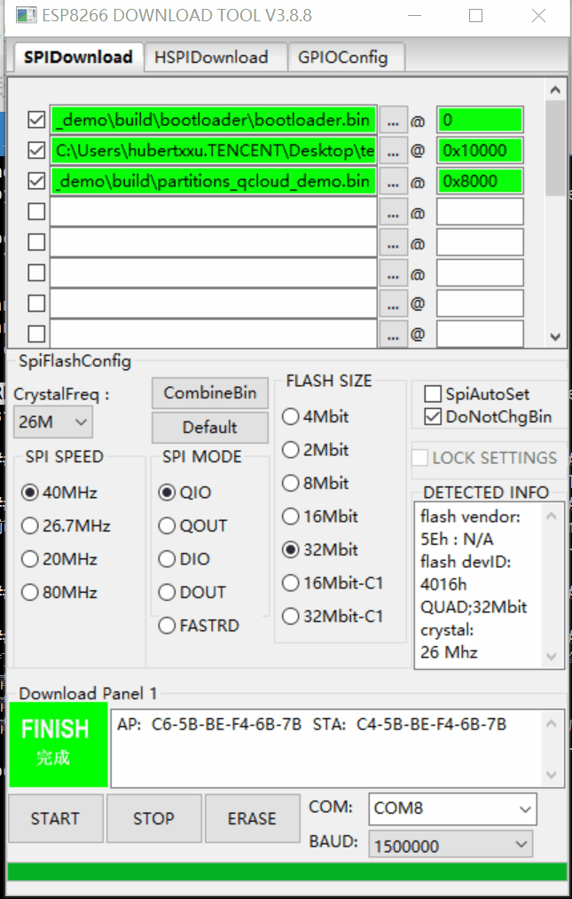
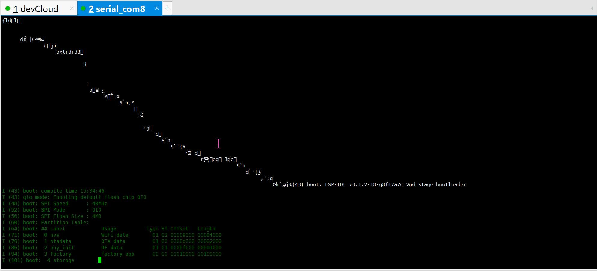
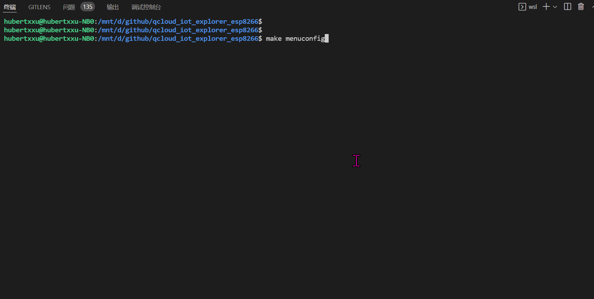
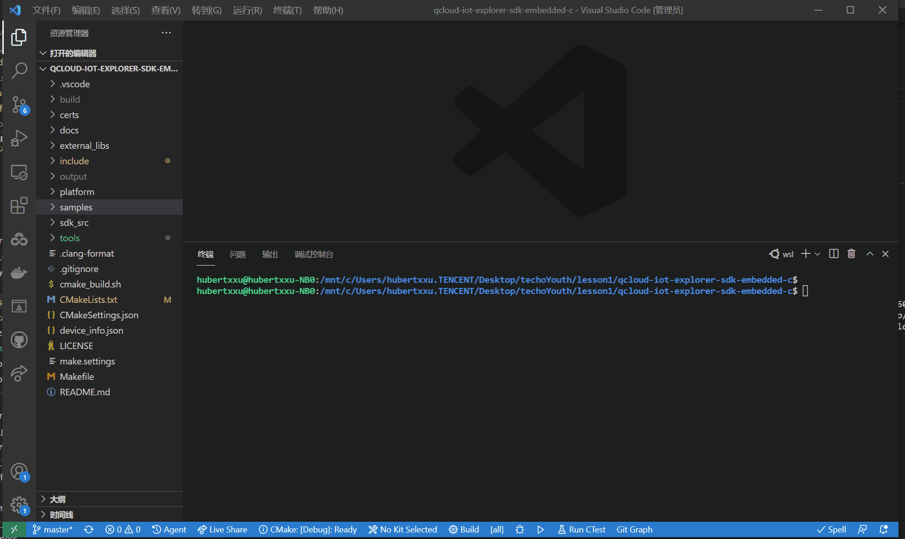
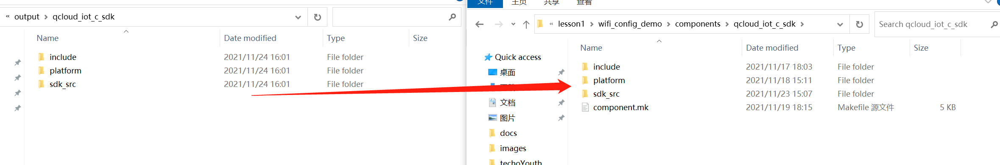

# 腾讯云物联网开发平台设备端C-SDK for ESP8266
本文档介绍如何将腾讯云[物联网开发平台C-SDK](https://github.com/tencentyun/qcloud-iot-explorer-sdk-embedded-c)移植到乐鑫 **ESP8266 RTOS** 平台，并提供可运行的samples。对于物联网开发平台的详细使用，请参考[官网文档](https://cloud.tencent.com/document/product/1081)。

本项目基于NodeMCU ESP8266开发板，关于开发板的详细介绍，请参考[这里](https://docs.ai-thinker.com/esp8266/boards/nodemcu)。

例程支持情况：

| samples                                                      | 说明                                                         | 备注                                                         |
| ------------------------------------------------------------ | ------------------------------------------------------------ | ------------------------------------------------------------ |
| [mqtt_sample](./main/samples/mqtt/mqtt_sample.c)             | [MQTT连接](https://github.com/tencentyun/qcloud-iot-explorer-sdk-embedded-c/blob/master/docs/mqtt_sample_%E5%BF%AB%E9%80%9F%E5%85%A5%E9%97%A8.md)例程 |                                                              |
| [data_template_sample](./main/samples/data_template/data_template_sample.c) | [数据模板](https://github.com/tencentyun/qcloud-iot-explorer-sdk-embedded-c/tree/master/docs/%E6%95%B0%E6%8D%AE%E6%A8%A1%E6%9D%BF%E5%BC%80%E5%8F%91)例程 | 使用[codegen.py](https://github.com/tencentyun/qcloud-iot-explorer-sdk-embedded-c/blob/master/tools/codegen.py)生成 |
| [dynreg_sample](./main/samples/dynreg_dev/dynreg_dev_sample.c) | [动态注册](https://github.com/tencentyun/qcloud-iot-explorer-sdk-embedded-c/blob/master/docs/%E5%8A%A8%E6%80%81%E6%B3%A8%E5%86%8C%E4%BD%BF%E7%94%A8%E8%AF%B4%E6%98%8E.md)例程 |                                                              |
| [light_data_template_sample](main/samples/scenarized/light_data_template_sample.c) | [智能灯](https://github.com/tencentyun/qcloud-iot-explorer-sdk-embedded-c/blob/master/docs/IoT_Explorer%E5%BC%80%E5%8F%91%E5%B9%B3%E5%8F%B0%E5%BF%AB%E9%80%9F%E5%85%A5%E9%97%A8.md)示例 |                                                              |
| [wifi_config_sample](main/samples/wifi_config/wifi_config_sample.c) | [配网](https://github.com/tencentyun/qcloud-iot-explorer-sdk-embedded-c/blob/master/docs/%E8%85%BE%E8%AE%AF%E8%BF%9E%E8%BF%9E%E5%B0%8F%E7%A8%8B%E5%BA%8F%20WIFI%20%E9%85%8D%E7%BD%91.md)示例 | 支持softAP、SmartConfig和Air kiss配网                        |
| [raw_data_sample](main/samples/raw_data/raw_data_sample.c)   | 二进制数据传输示例                                           |                                                              |


## 快速开始

### 1. 获取 ESP8266_RTOS_SDK 以及编译器
本项目基于**Linux(ubuntu)**环境进行开发，关于ESP8266开发的基础知识，请参考其 [开发指南](https://docs.espressif.com/projects/esp-idf/zh_CN/latest/esp32/get-started/linux-setup.html)

本项目基于ESP8266_RTOS_SDK v3.1版本开发，如果使用更高版本可能会**报错**，请自行解决。
```
git clone --single-branch -b release/v3.1 https://github.com/espressif/ESP8266_RTOS_SDK.git
```

ESP8266_RTOS_SDK编译需要python及pip，并且需要安装以下python库及软件

```shell
sudo apt-get install git wget flex bison gperf python python-pip python-setuptools cmake ninja-build ccache libffi-dev libssl-dev
pip install pyserial
pip install xlrd
```

下载ESP8266_RTOS_SDK后需要将IDF_PATH路径设置到环境变量中

```shell
# 设置IDF_PATH
export IDF_PATH=/mnt/d/UGit/ESP8266_RTOS_SDK
```

编译toolchain请参考ESP8266_RTOS_SDK/README.md，推荐使用

* [Linux(64) GCC 5.2.0](https://dl.espressif.com/dl/xtensa-lx106-elf-linux64-1.22.0-92-g8facf4c-5.2.0.tar.gz)

在Linux安装toolchain之后，需要将toolchain的bin目录添加到PATH环境变量中

```shell
# 设置编译工具链
export PATH=$PATH:/opt/xtensa-lx106-elf/bin
```


### 2.腾讯云物联网开发平台 C-SDK 代码

项目默认已经包含了一个腾讯云IoT Explorer C-SDK [v3.1.9](https://github.com/tencentyun/qcloud-iot-explorer-sdk-embedded-c/releases/tag/v3.1.9)的代码。**如需要更新可参考文档底部说明**

### 3.工程目录结构
在下载了ESP8266 RTOS SDK之后，应该具有以下目录结构（部分文件没有展示出来）
```shell
├── components
│   ├── qcloud_iot_c_sdk
│   │   ├── component.mk
│   │   ├── include
│   │   ├── platform
│   │   └── sdk_src
│   └── qrcode
│       ├── component.mk
│       ├── include
│       └── src
├── main
│   ├── Kconfig.projbuild
│   ├── board_ops.c
│   ├── board_ops.h
│   ├── component.mk
│   ├── main.c
│   ├── ota_esp
│   │   ├── qcloud_iot_ota_esp.c
│   │   └── qcloud_iot_ota_esp.h
│   ├── qcloud_iot_demo.h
│   └── samples
│       ├── data_template
│       ├── dynreg_dev
│       ├── gateway
│       ├── mqtt
│       ├── raw_data
│       ├── scenarized
│       └── wifi_config
├── ota_data_initial.bin
├── partitions_qcloud_demo.csv
├── sdkconfig
├── sdkconfig.old
├── sdkconfig.qcloud
├── Makefile
├── README.md
├── build
```

工程的组织结构参考ESP8266_FREE_RTOS风格，其中`components`文件夹里面存放了两个组件

```shell
├── components # 组件文件夹
│   ├── qcloud_iot_c_sdk # 腾讯云物联网开发平台执行C-SDK代码抽取后的源文件
│   └── qrcode           # 生成二维码组件
```

main文件夹存放了项目入口函数`main.c`和一些开发板硬件初始化函数，其中`samples`文件夹里面存放了腾讯云物联网开发平台的各个示例文件。

```shell
│   └── samples				# 示例文件夹
│       ├── data_template	# 数据模板示例
│       ├── dynreg_dev		# 动态注册示例
│       ├── gateway			# 网关示例
│       ├── mqtt			# mqtt示例
│       ├── raw_data		# hex传输示例
│       ├── scenarized		# 场景示例，如智能灯
│       └── wifi_config		# 配网示例
```


### 4.修改设备三元组信息

到`components/qcloud_iot/qcloud_iot_c_sdk/platform/HAL_Device_freertos.c`里面修改在腾讯云物联网平台注册的设备信息（目前仅支持密钥设备）：

```c
/* Product Id */
static char sg_product_id[MAX_SIZE_OF_PRODUCT_ID + 1]    = "PRODUCT_ID";
/* Device Name */
static char sg_device_name[MAX_SIZE_OF_DEVICE_NAME + 1]  = "YOUR_DEV_NAME";
/* Device Secret */
static char sg_device_secret[MAX_SIZE_OF_DEVICE_SECRET + 1] = "YOUR_IOT_PSK";
```

### 5.编译及烧写
1. 执行make menuconfig可进行功能配置，以MQTT sample为例，填入当前网络环境的WiFi名称和密码



2. 再执行`make -j8`就可以在build目录下面生成镜像。



3. 烧写镜像可以在Linux下面执行make flash命令，或者使用乐鑫在Windows下面的FLASH_DOWNLOAD_TOOLS工具



4. 烧写成功之后可以重启开发板运行程序



## 固件升级

1. 本例程提供了完整的固件升级示例，首先通过`menuconfig` 选择`Factory app, two OTA definitions)`，然后使能`Enable OTA support on ESP` 



2. 如果你想在自己的项目中使能OTA功能，出了上述配置之外，在初始化完成mqtt后，还需要调用`enable_ota_task`具体的使用方法，请参考`light_data_template_sample.c`示例。

```c
    rc = enable_ota_task(&sg_devInfo, IOT_Template_Get_MQTT_Client(client), "1.0.3");
    if (rc)
        Log_e("Start OTA task failed!");
```

3. 烧录时，注意选择`build\partitions_two_ota.bin`


## 更新腾讯云物联网开发平台SDK版本

1. 从GitHub拉取最新的代码，建议拉取release版本代码

```shell
# 腾讯云物联网开发平台 IoT Explorer
git clone https://github.com/tencentyun/qcloud-iot-explorer-sdk-embedded-c.git
```

2. 执行代码抽取，生成本项目的组件



3. 替换需要更新的源文件

   将生成的`output\qcloud_iot_c_sdk`拷贝到本项目的`components\qcloud_iot_c_sdk`



> 注意：文件拷贝过去后需要仔细检查接口，有些接口需要重新适配！

## AT 固件

最新AT固件请移步乐鑫官网[下载](https://docs.espressif.com/projects/esp-at/zh_CN/release-v2.2.0.0_esp8266/Customized_AT_Commands_and_Firmware/Tencent_Cloud_IoT_AT/index.html)。

## 配套视频教程

- [设备快速上云](https://cloud.tencent.com/developer/salon/live-1602)
- [腾讯连连WiFi配网](https://cloud.tencent.com/developer/salon/live-1622)

